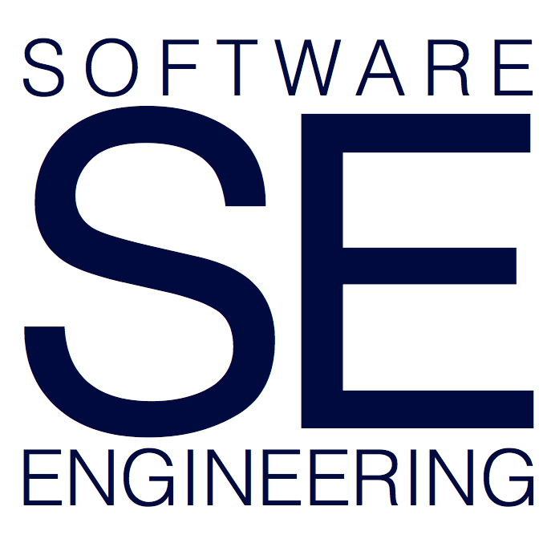

# UBC CPSC 539F - Sensing and Supporting Developer Productivity (Topics in PL)

Term 1, Monday and Wednesday 10:30am to 12pm

Room: ICCS 246

## Overview

Producing great software as fast as the market demands requires great, productive developers. Yet, what does it mean for an individual developer to be productive, and how can we best help developers to be productive? To answer these questions, researchers in software engineering have been, and are still predominantly looking at the output that software developers create, such as the applications, the source code, or the test cases. This output-oriented focus misses one of the most essential parts in the process of software development: the individual developer who creates the software.

Recent advances in technology afford the opportunity to collect a wide variety of detailed information on a software developer and her work, ranging from the number of resolved work items all the way to the cognitive load the developer experiences while working. The availability and accessibility of data on each developer is enabling us to explore questions about developer productivity in powerful new ways. 

In this course we investigate how we can ensure the human ingenuity and smarts are being amplified by the processes and tools used to create systems, rather than the humans spending precious cognitive effort dealing with mundane or unnecessary problems.

The course will be adjusted according to your feedback, interests, and experience. This is an overview of the kinds of topics we could cover:
* developer productivity
* biometric sensing
* tool support for software developers
* work fragmentation and interruptions
* self-monitoring and goal setting
* program comprehension
* software evolution
* quantitative and qualitative evaluation of SD research

## Format

This will be a project and paper-based course. The research project is the primary artifact of the course; the outcome of all projects will be a short research paper. Depending on the class size, the projects may be completed in groups of up to three. The intent of the project is to get students think about a research problem, identify a research question, investigate it and write it up.

In this course, you will also be reading research papers and writing short response papers for each class in preparation, leading interactive paper discussion(s), and writing peer-reviews of papers.

## Grading Scheme

| % of Final Grade | Component |
| :-- | :-- |
| 55% | Project (including proposal, report, presentation) |
| 10% | Peer reviews of project reports |
| 35% | Readings (including response papers, moderation, class participation) |

#### Late Submissions

Late submissions will not be accepted.

## Contact

#### Instructor: [Thomas Fritz](https://www.cs.ubc.ca/people/thomas-fritz)

Office hours are by appointment. Email me (fritz at cs.ubc.ca to) or get in touch with me after class.

## Schedule

| Date | Paper | Presenter |
| :-- | :-- | :-- |
| Sep 6 | Course Intro | Thomas |
| Sep 11 | [Preliminary guidelines for empirical research in software engineering](http://ieeexplore.ieee.org/document/1027796/?arnumber=1027796&tag=1) Kitchenham et al., IEEE TSE 2002.  | Thomas |
| | [Experimental models for validating technology.](http://ieeexplore.ieee.org/stamp/stamp.jsp?arnumber=675630) Zelkowitz et al., IEEE Computer, 1998. | |
| Sep 13 | [What makes good research in software engineering?](https://link.springer.com/content/pdf/10.1007%2Fs10009-002-0083-4.pdf) Shaw, Int J STTT 2002. | Thomas |
| | [Software Developers’ Perceptions of Productivity.](http://www.zora.uzh.ch/id/eprint/98324/1/productivity.pdf) Meyer et al., FSE 2014. | |

## Research Project

The research project is the primary artifact of the course; the outcome of all projects will be a research paper (5 to 10 pages). Depending on the class size, the projects may be completed in groups of up to two. The intent of the project is to identify one or more research questions, investigate them and report the results in a scientific manner.

## Academic Conduct

Each student is responsible for understanding and abiding by the University and Departmental policies on academic conduct. Specifically:

* [UBC policy on Academic Misconduct](http://www.calendar.ubc.ca/vancouver/index.cfm?tree=3,54,111,959)
* [Computer Science Department Lab policies and responsibilities](https://www.cs.ubc.ca/our-department/administration/policies/collaboration)

### Respectful Environment

Everyone involved with this course is responsible for understanding and abiding by the University's Respectful Environment Statement.

The Statement of Principle of UBC's Respectful Environment Statement is "The best possible environment for working, learning and living is one in which respect, civility, diversity, opportunity and inclusion are valued. Everyone at the University of British Columbia is expected to conduct themselves in a manner that upholds these principles in all communications and interactions with fellow UBC community members and the public in all University-related settings."

